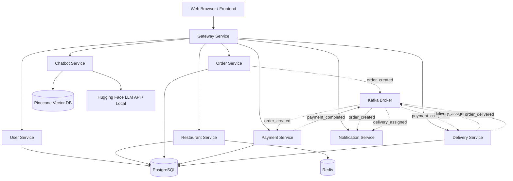

# Implementation Plan - Food Delivery Web Application

This document outlines the design and implementation details for a production-grade, Python-based Food Delivery Web Application using microservices architecture, FastAPI, PostgreSQL, Kafka (KRaft), Redis, and a Retrieval-Augmented Generation (RAG) customer service chatbot.

---

## Architecture Overview



---

## User Review Required

> [!IMPORTANT]
> **External Credentials and AI Services:**
> 1. **Pinecone API Key:** To index menu/FAQ documents, a Pinecone account is needed. We will implement a mock vector database fallback inside `vector_store.py` so the application runs perfectly out-of-the-box even without a Pinecone API key.
> 2. **Hugging Face API Key:** Running a 7B LLM locally inside Docker requires significant RAM/GPU power. We will configure the Chatbot Service to use the Hugging Face Inference API by default (with free public endpoints or an API token) and fall back to a lightweight local model or simulated responses if unavailable.
> 3. **Kafka Setup:** We are using KRaft mode for Kafka. The docker-compose configuration will boot a single Kraft broker container, which has low overhead.

---

## Proposed Changes

We will create a multi-service structure inside the `/Users/shashankralhi/Downloads/Food Delivery App` folder:

### 1. Common Utility Package (`common/`)

Shared components reused by other services to avoid copy-pasting code:
* **`database.py`**: SQLAlchemy engines, base declaration, dynamic session provider.
* **`security.py`**: JWT encoding/decoding, Password hashing (bcrypt), and current user dependency injections.
* **`kafka_client.py`**: Standardized Kafka producer & consumer wrapper with automatic retries and dead letter queuing (DLQ).
* **`schemas.py`**: Reusable Pydantic models (User models, Order statuses, Common Response templates).

### 2. User Service (`user_service/`)

Manages customer, restaurant owner, delivery partner, and admin profile data.
* **APIs**:
  * `POST /api/auth/register` (Register new user with role: Customer, Restaurant Owner, Delivery Partner, Admin)
  * `POST /api/auth/login` (Obtain JWT token)
  * `GET /api/users/profile` (Fetch profile details)
  * `PUT /api/users/profile` (Update name, email)
  * `GET /api/users/addresses` (Get saved addresses)
  * `POST /api/users/addresses` (Add saved address)

### 3. Restaurant Service (`restaurant_service/`)

Handles restaurants, menus, cuisines, ratings, and reviews. Reuses Redis for menu caching.
* **APIs**:
  * `GET /api/restaurants` (Query & filter restaurants by cuisine, location, ratings)
  * `POST /api/restaurants` (Create restaurant - Owner/Admin only)
  * `GET /api/restaurants/{id}` (Get restaurant info)
  * `GET /api/restaurants/{id}/menu` (Get menu list - cached in Redis)
  * `POST /api/restaurants/{id}/menu` (Add menu items - Owner/Admin only)
  * `POST /api/restaurants/{id}/reviews` (Add rating/review - Customer only)

### 4. Order Service (`order_service/`)

Processes checkout cart contents and manages order life cycles.
* **APIs**:
  * `POST /api/orders` (Place order, inserts to `orders` and `order_items`, publishes `order_created` to Kafka)
  * `GET /api/orders` (View active & past orders)
  * `GET /api/orders/{id}` (Retrieve order state & tracking logs)
  * `PUT /api/orders/{id}/status` (Update order status manually - Admin/Delivery/Owner)

### 5. Payment Service (`payment_service/`)

Handles transaction states. Consumes Kafka topic `order_created`, simulates/processes payments, and logs transaction updates to database.
* **Kafka Consumer**: Consumes `order_created` -> Processes payment status -> Publishes `payment_completed` (if successful).
* **APIs**:
  * `GET /api/payments/{order_id}` (Verify payment status)

### 6. Delivery Service (`delivery_service/`)

Coordinates delivery partner allocations and tracks order navigation.
* **Kafka Consumer**: Consumes `payment_completed` -> Auto-assigns available delivery partner -> Publishes `delivery_assigned`.
* **APIs**:
  * `GET /api/delivery/active` (For delivery partners: view assigned orders)
  * `PUT /api/delivery/{order_id}/status` (Update status to Picked Up / Out for Delivery / Delivered. Delivers `order_delivered` to Kafka when finalized).

### 7. Notification Service (`notification_service/`)

Consumes order lifecycle Kafka topics and issues mock delivery emails, SMS text, or client-side status feeds.
* **Kafka Consumer**: Consumes `order_created`, `delivery_assigned`, `order_delivered`. Logs/emits notifications.

### 8. Chatbot Service (`chatbot_service/`)

Runs an intelligent customer assistance endpoint utilizing Hugging Face LLM and Pinecone.
* **APIs**:
  * `POST /api/chat` (Submit inquiry, returns streaming or complete text with memory and citations)
* **Components**:
  * `index_manager.py`: Connects to Pinecone, provisions vector index.
  * `vector_store.py`: Performs embedding vector queries (with local Mock fallback).
  * `ingestion_pipeline.py`: Chunks text documents (FAQ, guidelines) and builds vector databases.
  * `chatbot_agent.py`: RAG logic combining history memory, custom templates, LangChain, and Qwen/Mistral LLM.

### 9. Gateway Service (`gateway/`)

Acts as the single entryway for the application:
* Proxies incoming API requests to the respective microservices backend.
* Serves the HTML pages rendered with Jinja2 templates.
* Manages session cookies (translating to JWT headers for microservices).

---

## Database Schema Design

Normalized PostgreSQL schema:

```sql
-- Roles: Customer, Restaurant Owner, Delivery Partner, Admin
CREATE TABLE users (
    id SERIAL PRIMARY KEY,
    name VARCHAR(100) NOT NULL,
    email VARCHAR(100) UNIQUE NOT NULL,
    password_hash VARCHAR(255) NOT NULL,
    role VARCHAR(50) NOT NULL,
    created_at TIMESTAMP DEFAULT CURRENT_TIMESTAMP
);

CREATE TABLE user_addresses (
    id SERIAL PRIMARY KEY,
    user_id INT REFERENCES users(id) ON DELETE CASCADE,
    address_line VARCHAR(255) NOT NULL,
    city VARCHAR(100) NOT NULL,
    latitude DOUBLE PRECISION,
    longitude DOUBLE PRECISION,
    is_default BOOLEAN DEFAULT FALSE
);

CREATE TABLE restaurants (
    id SERIAL PRIMARY KEY,
    owner_id INT REFERENCES users(id) ON DELETE SET NULL,
    restaurant_name VARCHAR(150) NOT NULL,
    description TEXT,
    rating NUMERIC(3, 2) DEFAULT 0.0,
    location VARCHAR(255) NOT NULL,
    image_url VARCHAR(255),
    created_at TIMESTAMP DEFAULT CURRENT_TIMESTAMP
);

CREATE TABLE menu_items (
    id SERIAL PRIMARY KEY,
    restaurant_id INT REFERENCES restaurants(id) ON DELETE CASCADE,
    name VARCHAR(150) NOT NULL,
    description TEXT,
    price NUMERIC(10, 2) NOT NULL,
    image_url VARCHAR(255),
    is_available BOOLEAN DEFAULT TRUE
);

-- Order Statuses: Created, Paid, Preparing, Assigned, OutForDelivery, Delivered, Cancelled
CREATE TABLE orders (
    id SERIAL PRIMARY KEY,
    user_id INT REFERENCES users(id) ON DELETE SET NULL,
    restaurant_id INT REFERENCES restaurants(id) ON DELETE SET NULL,
    total_amount NUMERIC(10, 2) NOT NULL,
    order_status VARCHAR(50) NOT NULL DEFAULT 'Created',
    delivery_address VARCHAR(255) NOT NULL,
    created_at TIMESTAMP DEFAULT CURRENT_TIMESTAMP
);

CREATE TABLE order_items (
    id SERIAL PRIMARY KEY,
    order_id INT REFERENCES orders(id) ON DELETE CASCADE,
    menu_item_id INT REFERENCES menu_items(id) ON DELETE SET NULL,
    quantity INT NOT NULL,
    price NUMERIC(10, 2) NOT NULL
);

CREATE TABLE payments (
    id SERIAL PRIMARY KEY,
    order_id INT REFERENCES orders(id) ON DELETE CASCADE,
    payment_status VARCHAR(50) NOT NULL DEFAULT 'Pending',
    transaction_id VARCHAR(100),
    amount NUMERIC(10, 2) NOT NULL,
    created_at TIMESTAMP DEFAULT CURRENT_TIMESTAMP
);

CREATE TABLE delivery_partners (
    id SERIAL PRIMARY KEY,
    user_id INT REFERENCES users(id) ON DELETE CASCADE,
    name VARCHAR(100) NOT NULL,
    phone VARCHAR(20) NOT NULL,
    vehicle_type VARCHAR(50),
    is_available BOOLEAN DEFAULT TRUE
);

CREATE TABLE order_deliveries (
    id SERIAL PRIMARY KEY,
    order_id INT REFERENCES orders(id) ON DELETE CASCADE,
    delivery_partner_id INT REFERENCES delivery_partners(id) ON DELETE SET NULL,
    status VARCHAR(50) NOT NULL DEFAULT 'Assigned',
    assigned_at TIMESTAMP DEFAULT CURRENT_TIMESTAMP,
    delivered_at TIMESTAMP
);

CREATE TABLE reviews (
    id SERIAL PRIMARY KEY,
    user_id INT REFERENCES users(id) ON DELETE SET NULL,
    restaurant_id INT REFERENCES restaurants(id) ON DELETE CASCADE,
    rating INT NOT NULL CHECK (rating >= 1 AND rating <= 5),
    comment TEXT,
    created_at TIMESTAMP DEFAULT CURRENT_TIMESTAMP
);
```

---

## User Interface Design

The frontend will use a sleek, modern, minimal theme:
* **Color Palette**:
  - Primary Background: `#FFFFFF` (Pure White)
  - Card/Section Backgrounds: `#F8F9FA` & `#F1F3F5` (Light Gray / Platinum)
  - Primary Typography: `#1A1D20` (Off-black)
  - Accent color: `#10B981` (Vibrant Mint Green) & `#059669` (Darker Green for Hover states)
  - Border lines: `#E5E7EB` (Subtle divider)
* **UX/Interactivity**:
  - Round border styling: `border-radius: 12px;` or `rounded-xl` standard.
  - Floating chatbot interface on the bottom-right corner of all customer pages.
  - Interactive layouts showing responsive views for all user segments (Customers, Delivery Partners, Restaurant Owners, Admins).

---

## Verification Plan

### Automated Tests
We will build test modules under `tests/` using `pytest`:
* **`tests/test_auth.py`**: Unit tests verifying JWT token generation, role verification, and registration validation.
* **`tests/test_restaurant.py`**: Unit test for listing restaurants, reading menus, and Redis caching.
* **`tests/test_orders.py`**: Testing order creation and status modifications.
* **`tests/test_chatbot.py`**: Unit tests mock-validating semantic RAG search output.
* **Command to run**:
  ```bash
  pytest -v
  ```

### Manual Verification
1. Boot the environment using `docker-compose up --build`.
2. Inspect the API Swagger docs:
   - Gateway Docs: `http://localhost:8000/docs`
3. Access the browser UI at `http://localhost:8000/`.
4. Register a user, select items, add to cart, and complete checkout.
5. Follow Kafka message logs to ensure that payment simulation, delivery partner selection, and notification logic proceed sequentially.
6. Open the chatbot floating widget, ask a question (e.g., "What is the refund policy?"), and check the reply context.
