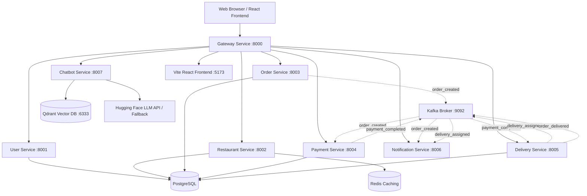

# Updated Implementation Plan - Qdrant & React JS Frontend

This document outlines the architectural pivot to transition the vector database integration from Pinecone to Qdrant, and transition the user interface from server-side HTML/Jinja2 templates to a modern client-side React JS application built with Vite.

---

## Architecture Updates



---

## Proposed Changes

### 1. Vector Database: Transition to Qdrant

Instead of Pinecone, we will integrate **Qdrant** using the `qdrant-client` SDK.
* **`chatbot_service/index_manager.py`**:
  - Connects to Qdrant server (default host: `qdrant`, port: `6333`).
  - Manages Qdrant collections (checks if collection `food_delivery_faq` exists, otherwise creates it with Cosine distance and 384 dimensions).
* **`chatbot_service/vector_store.py`**:
  - Uses `QdrantClient` for operations.
  - Inserts document vectors and stores text content + source metadata in payload format.
  - Queries vectors using collection name and metadata filters.
  - Includes a fallback to local in-memory Qdrant client (`path=":memory:"`) if Qdrant server credentials/connection are missing.
* **`docker-compose.yml`**:
  - Replaces Pinecone description, boots a `qdrant` database container image (`qdrant/qdrant:latest`) exposing port `6333` and maps storage directories.
* **`requirements.txt`**:
  - Replaces `pinecone-client` with `qdrant-client`.

### 2. Frontend: React JS (Vite) Setup

The server-side Jinja2 template pages will be completely replaced with a React client-side application.
* **Directory structure**:
  Create React app inside `frontend/` using Vite template:
  `frontend/`
  ├── `src/`
  │   ├── `components/` (Header, Footer, RAG Chatbot Widget)
  │   ├── `pages/` (Home, Login, Register, Listings, Restaurant Details, Cart, Checkout, Dashboards)
  │   ├── `App.jsx`
  │   ├── `index.css`
  │   └── `main.jsx`
  ├── `index.html`
  ├── `package.json`
  └── `vite.config.js`
* **Vite Config**:
  - Configures Vite dev server on port `5173`.
  - Configures API routing proxy to Gateway (port `8000`) or vice-versa.
* **Gateway (`gateway/main.py`)**:
  - Redirects static page hits to the Vite React Frontend container (proxying `/` and static assets to `http://frontend:5173`), or serves built React files. Let's make Gateway proxy root files to the React development server in developer mode for real-time hot-reloads!
* **Docker Compose**:
  - Adds a `frontend` service building the React app and running `npm run dev` or equivalent server.

---

## Database (Qdrant Schema)

* **Collection Name**: `food_delivery_faq`
* **Vector Configuration**:
  - Size: `384`
  - Distance Metric: `Cosine`
* **Payload Structure**:
  ```json
  {
    "text": "Chunk content...",
    "source": "faq.txt",
    "category": "refund",
    "index": 0
  }
  ```

---

## Verification Plan

### Automated Tests
* **`tests/test_chatbot.py`**: Update tests to verify Qdrant indexing, Cosine vector querying, and RAG document matching.
* Run with: `pytest -v`

### Manual Verification
1. Boot the environment via `docker-compose up --build`.
2. Access the React Frontend at `http://localhost:8000/` or `http://localhost:5173/`.
3. Check the chatbot widget; query "What is the refund policy?" to verify RAG fetches answers from Qdrant.
